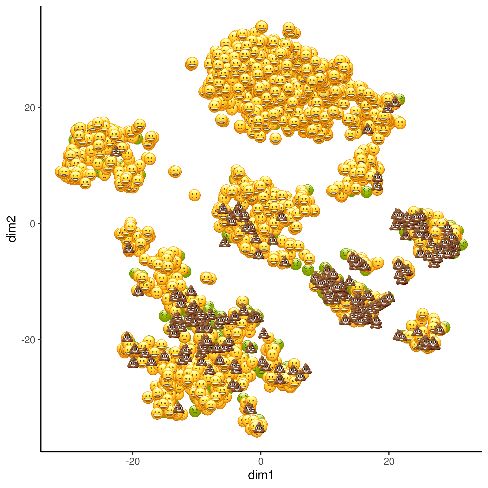

<!-- README.md is generated from README.Rmd. Please edit that file -->

# scrappy

<!-- badges: start -->

<!-- badges: end -->

scrappy provides an easy way to visualize the quality of scRNA
single-cells.

## Installation

You can install the development version with:

``` r
install.packages("devtools")
remotes::install_github("darlanminussi/scrappy")
```

scrappy uses the percentage of mitochondrial gene expression to classify
the cells as:

😄: Great Quality 🙂: Good quality 😣: OK quality 💩: Low quality

scrappy offers wrappers for
[SingleCellExperiment](https://osca.bioconductor.org/) as well as
[Seurat](https://satijalab.org/seurat/) objects.

## Example

``` r
sce
#> class: SingleCellExperiment 
#> dim: 20006 3005 
#> metadata(0):
#> assays(2): counts logcounts
#> rownames(20006): Tspan12 Tshz1 ... mt-Rnr1 mt-Nd4l
#> rowData names(1): featureType
#> colnames(3005): 1772071015_C02 1772071017_G12 ... 1772066098_A12
#>   1772058148_F03
#> colData names(26): tissue group # ... altexps_repeat_percent total
#> reducedDimNames(2): PCA TSNE
#> spikeNames(0):
#> altExpNames(2): ERCC repeat
```

``` r
library(scrappy)
plotScrappy(sce, "TSNE")
```


